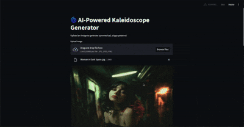

# 🌀 AI-Powered Kaleidoscope Generator

Create symmetrical, psychedelic kaleidoscope patterns from real-world images using OpenCV, NumPy, and Streamlit. Enhance the visuals with vibrant colormap filters for a trippy effect!

---

## 🎥 Demo Preview



> Upload → Transform → Trip Out 🎨  
> *Watch the image morph into a kaleidoscopic illusion with just a few clicks!*

---

## 🌟 Features

- Upload any image (JPG/PNG)
- Generate kaleidoscope patterns with customizable segment count
- Add psychedelic effects using trippy colormaps
- Built with a clean and interactive **Streamlit** UI

---

## 🛠️ Installation

### 1. Clone the repo
```bash
git clone https://github.com/yourusername/ai-kaleidoscope.git
cd ai-kaleidoscope
```

### 2. (Optional) Create a virtual environment
```bash
python -m venv Kaleidoscope
source Kaleidoscope/bin/activate  # macOS/Linux
Kaleidoscope\Scripts\activate     # Windows
```

### 3. Install dependencies
```bash
pip install -r requirements.txt
```

---

## 🚀 Run the App

```bash
streamlit run app.py
```

---

## 📁 Project Structure

```
ai-kaleidoscope/
├── app.py                  # Streamlit app (main interface)
├── kaleidoscope_utils.py  # Utility functions for image processing
├── requirements.txt        # Python package dependencies
├── sample_images/          # (Optional) Folder for demo images
└── demo/demo.gif           # 🎥 GIF preview (put your demo here)
```

---

## 🧠 How It Works

### 1. Image Upload
Users upload any image via the UI.

### 2. Kaleidoscope Effect
- The image is resized and divided into angular segments.
- Each segment is rotated and mirrored around a center point using OpenCV.
- Result: a symmetrical, visually trippy pattern.

### 3. Colormap Transformation
- The image is converted to grayscale.
- OpenCV colormaps like `PLASMA`, `INFERNO`, `RAINBOW`, etc., are applied.
- The image is then converted back to RGB for display.

---

## 🎨 Colormap Options

- PLASMA
- INFERNO
- MAGMA
- TURBO
- OCEAN
- RAINBOW

These filters give the kaleidoscope a psychedelic aesthetic 🌈

---

## ✅ Future Improvements to be make soon 

- Add a "Download" button for the generated image
- Add live animated kaleidoscope preview
- Generate patterns using AI (GAN/VAE)
- Deploy to Streamlit Cloud or Hugging Face Spaces

---

## 🤝 Credits

Built with ❤️ by [Anirudh Tyagi](https://github.com/itsanirudhtyagi)  
Powered by:
- [OpenCV](https://opencv.org/)
- [Streamlit](https://streamlit.io/)
- [NumPy](https://numpy.org/)

---

## 📜 License

This project is licensed under the MIT License.  
Feel free to use, fork, and remix!

---
